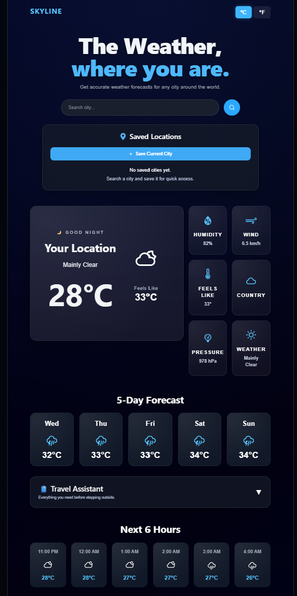
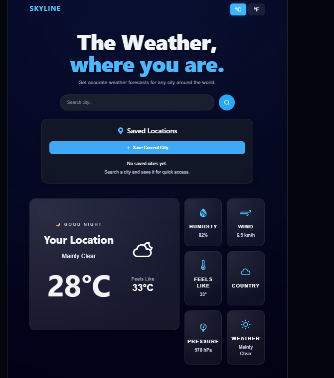
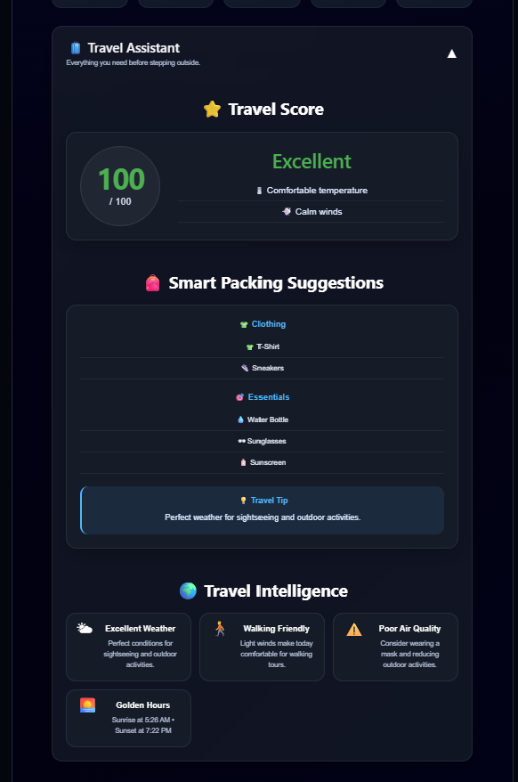
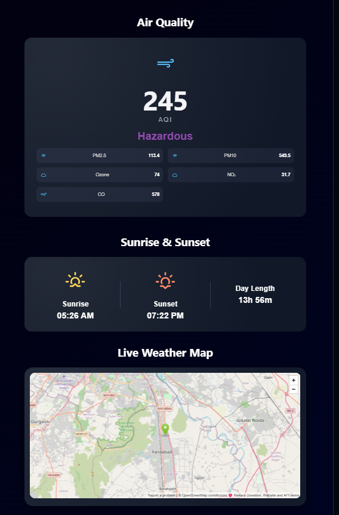

# 🌤️ Skyline – Full Stack Travel Weather Dashboard

A modern **full-stack weather and travel dashboard** built with **React, Node.js, Express, SQLite, and Open-Meteo APIs**. Skyline provides real-time weather information, intelligent travel insights, air quality monitoring, forecasts, and personalized travel recommendations through a clean, responsive interface.

---

## 🌐 Live Demo

Frontend:
https://skyline-six-navy.vercel.app

Backend API:
https://skyline-ldem.onrender.com

GitHub Repository:
https://github.com/shylasharma/Skyline

---

## 📸 Project Screenshots

### 🏠 Home


### 📊 Weather Dashboard


### 🧳 Travel Assistant


### 🌍 Environment


---

# ✨ Features

## 🌤️ Weather
- Live weather by city search
- Automatic location detection
- Dynamic weather backgrounds
- Temperature, humidity, wind speed, pressure
- Feels-like temperature
- Weather condition icons
- Day/Night greeting

## 📅 Forecast
- 5-Day Weather Forecast
- Next 6 Hours Forecast
- Sunrise & Sunset timings

## 🌍 Environment
- Air Quality Index (AQI)
- PM2.5, PM10
- Carbon Monoxide
- Nitrogen Dioxide
- Ozone Levels

## 🗺️ Maps
- Interactive city location map
- Weather location visualization

## 🧳 Travel Assistant
- Travel Score
- Smart Packing Suggestions
- Travel Intelligence
- Weather-based travel recommendations

## 💾 Saved Locations
- Save favourite cities
- Quick city search
- Remove saved cities

## ⚙️ Backend
- RESTful API
- SQLite Database
- Weather Search History
- CRUD Operations
- Export History as JSON
- Export History as CSV

---

# 🏗️ Tech Stack

### Frontend
- React
- Vite
- CSS3
- Axios
- React Icons

### Backend
- Node.js
- Express.js
- SQLite3

### APIs
- Open-Meteo Weather API
- Open-Meteo Geocoding API
- Open-Meteo Air Quality API

---

# 📁 Project Structure

```
Skyline
│
├── backend
│   ├── controllers
│   ├── database
│   ├── routes
│   ├── services
│   └── server.js
│
├── frontend
│   ├── components
│   ├── services
│   ├── utils
│   └── App.jsx
│
├── screenshots
│
├── README.md
└── .gitignore
```

---

# 🚀 Installation

## Clone Repository

```bash
git clone https://github.com/YOUR_USERNAME/Skyline-Weather-Dashboard.git
```

## Install Backend

```bash
cd backend
npm install
npm start
```

## Install Frontend

```bash
cd frontend
npm install
npm run dev
```

---

# 🔌 API Endpoints

## Weather

```
GET /api/weather
```

Search weather by city.

---

## Current Location

```
GET /api/weather/coords
```

Weather using latitude & longitude.

---

## History

```
GET /api/history
```

Returns search history.

```
PATCH /api/history/:id/favorite
```

Toggle favourite history.

```
DELETE /api/history/:id
```

Delete one history record.

```
DELETE /api/history
```

Clear entire history.

---

## Export

```
GET /api/export/json
```

Export history as JSON.

```
GET /api/export/csv
```

Export history as CSV.

---

# 💡 Key Features Implemented

- Responsive UI
- Dynamic Weather Backgrounds
- Weather Icons
- Smart Travel Assistant
- SQLite Database Integration
- CRUD Operations
- Data Export
- Search History
- Error Handling
- REST API Architecture

---

# 🔮 Future Improvements

- User Authentication
- Weather Alerts
- Multi-language Support
- Favorite Cities Synchronization
- Historical Weather Analytics
- Weather Charts & Graphs
- Dark/Light Theme Toggle
- PWA Support

---

# 👩‍💻 Author

**Shyla Sharma**

Integrated B.Tech – M.Tech (Computer Science)

Gautam Buddha University

- GitHub: https://github.com/shylasharma

---

# 📄 License

This project was developed for learning and technical assessment purposes.